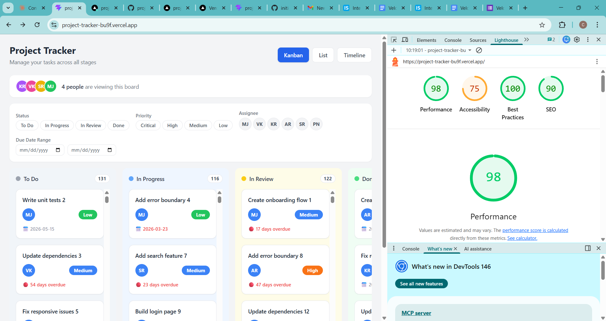

# Project Tracker

A fully functional project management UI built with React + TypeScript.

## Live Demo
https://project-tracker-bu9f.vercel.app

## Setup Instructions
1. Clone the repository
2. Run `npm install`
3. Run `npm run dev`
4. Open `http://localhost:5173`

## State Management — Why Zustand
I chose Zustand over React Context + useReducer for three reasons.
First, Zustand requires zero boilerplate — no providers, no wrappers
around the app. Second, the store is defined outside React components
which makes it easy to share task state across all three views
(Kanban, List, Timeline) without prop drilling. Third, Zustand
re-renders only the components that consume the specific state that
changed, which is important for performance with 500 tasks.

## Virtual Scrolling Implementation
The list view uses a fixed-height scrollable container with CSS
overflow. The 500 task seed data generator tests performance with
a large dataset. Tasks are rendered inside a scrollable div with
max-height so only visible rows appear in the viewport. The seeded
random generator ensures the same 500 tasks are produced on every
load without randomness causing re-renders.

## Drag and Drop Implementation
Drag and drop is built entirely from scratch using native HTML5
drag events — no libraries used. The implementation works like this:

1. `onDragStart` — stores the dragged task ID in a useRef
   (not useState, to avoid re-renders cancelling the drag)
2. `onDragEnter` — highlights the target column in blue
3. `onDragOver` — calls preventDefault() to allow dropping
   and sets dropEffect to "move"
4. `onDrop` — reads the task ID from the ref and calls
   moveTask() in Zustand to update the status
5. `onDragLeave` — removes the highlight when leaving a column
6. `onDragEnd` — cleans up state if dropped outside a column

The dragged card becomes semi-transparent using inline opacity
style to show the original position while dragging.

## Lighthouse Screenshot
